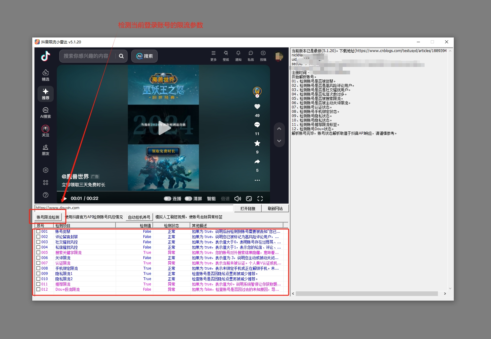

# douyin_radar
[2025-06-03] 抖音限流小雷达，抖音限流检测工具，自己业余用MFC写的一个工具，谨慎参考。

一、打开douyin_radar软件目录，运行douyin_radar.exe即可。

二、登录账号后点击“账号检测”。

三、诊断API参数如下：

		1.账号是否被封禁 -> 检测字段 : show_user_ban_dialog 
  
			如果为 true，说明后台检测到账号需要被告知“您已被封禁/限制操作”等异常提示，前端会弹出相应的封禁对话框。
   
		2.账号是否是高风险评论用户 -> 检测字段 : is_risk_comment_user 
  
			如果为 true，说明您已被标记为高风险评论用户，正常情况下将无法发表评论，或者评论需要审核，可能会出现“评论失败”或“请等待审核”等提示。
   
		3.账号是否是社交骚扰用户 -> 检测字段 : negative_social_user_type 
  
			如果为 true，表示值大于0，表明账号存在过辱骂、刷屏、骚扰等社交负面行为，被系统标记为社交“风险”用户，后续可能加剧限流、限评、限关、限赞等。
   
		4.账号是否私信次数过多 -> 检测字段 : user_rate 
  
			如果为 true，表示值大于1，表示您的私信、评论、点赞等操作已经过于频繁，并受到限制，一旦达到阈值后将被强制延迟或无法继续操作。
   
		5.账号是否被搜索限流 -> 检测字段 : hide_search 
  
			如果为 true，您的账号对外搜索结果隐藏，意味着被搜索限流或直接对搜索屏蔽。
   
		6.账号是否被主动关评限流 -> 检测字段 : comment_setting 
  
			如果为 true，表示值为 3，说明您主动或被动关闭了评论功能，这会导致推荐页也会被相应限流。如果您并未主动关闭评论操作却为True，则说明可能遭到限评。
   
		7.账号认证状态 -> 检测字段 : verification_type 
  
			如果为 true，表示当前未被认证。个人黄V认证或机构蓝V认证会有推荐加持。未认证个人用户推荐页会被降权推荐。
   
		8.账号手机绑定状态 -> 检测字段 : is_phone_binded 
  
			如果为 true，表示未绑定手机或正在解绑手机。未绑定手机号的账户会被严重限流。
   
		9.账号推荐限流标签 -> 检测字段 : need_recommend
  
		 	如果为 true，表示值为0。说明系统暂停让您获取额外的推荐流量。
    
	        10.账号Dou+状态 -> 检测字段 : with_douplus_entry
	 
	 		如果为 false，检查账号是否因过去的未知原因，导致的被无法进行Dou+投流的异常，你的个别视频可能存在过违规记录，被限制投流和限制推荐。
    

